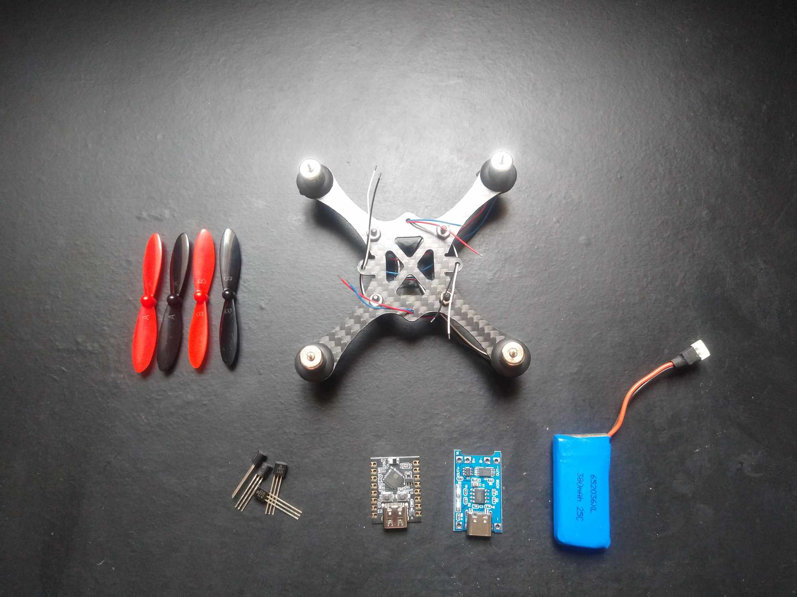

# AceMicroFlyer - ESP32-C3 (WIP) ✈️

### Introduction
After several years of not working on my IoT side projects, I have finally returned and decided to revisit an old project of a micro drone that I started 8 years ago but never finished. Now, I am determined to rebuild it from scratch.

### Project Overview 🛠️
The essence of this project lies not only in assembling the components and creating the PCB, but primarily in programming the flight controller. It serves as a proof of concept and is purely for my enjoyment. 

### Communication Method 📡
Despite being aware of the limitations of using Bluetooth for communication, the initial goal is to utilize it. The idea is for the drone to fly short distances. However, this may change, and if necessary, I will consider using a radio communication module. 

### Components Used
- 1x ESP32-C3 Mini (Microcontroller)
- 1x MPU9250 (Accelerometer, Gyroscope, Magnetometer)
- 4x 2N2222 NPN B331 Transistor (Motor Driver)
- 1x 3.7V 380mAh LiPo Battery
- 4x 8520 Coreless Motor (2x CW, 2x CCW)
- 4x 55mm Blade Propeller (2x CW, 2x CCW)
- 1x Carbon Fiber Mini Drone Frame

- 1x Type-C Micro Mini 5V1A 18650 TP4056 Lithium Battery Charger Module* (Just to charge the battery)

### Development Environment 💻
I'm using vscode with PlatformIO. 

**Note:** The image above is a representation of the components used in the project, but it's missing the MPU9250. The actual components may vary.